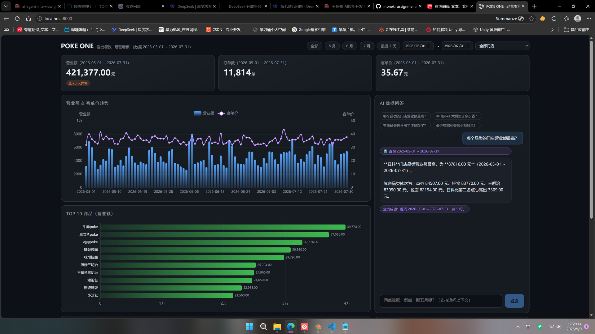
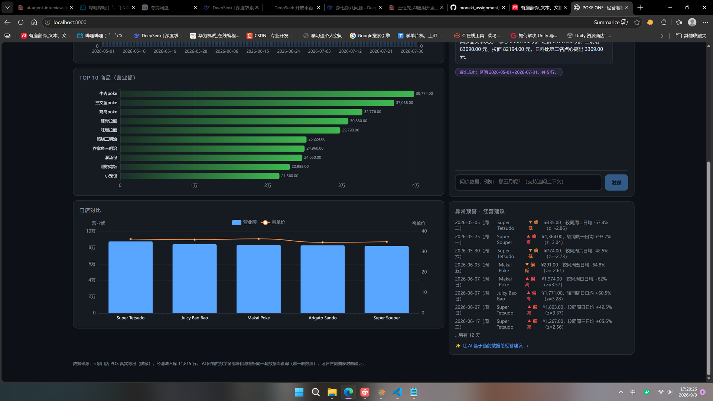

# POKE ONE 连锁餐饮经营看板 + AI 数据问答

[](https://github.com/trafalgar-law213/moneki_assignment/actions/workflows/ci.yml)

5 家门店脱敏 POS 数据（2026-05-01 ~ 2026-07-31，清洗后 11,815 条流水）→ **经营看板 + AI 自然语言问答**。

**核心主张：AI 回答中的每个数字都来自真实数据库查询，与看板接口逐一对账一致**——由「唯一取数层」架构保证（看板 API 与 AI 工具共用同一套查询函数），并由 mock / live 双层自动化测试守护"不编造"。

<p align="center">
  
  
</p>

## 功能

**经营看板**
- 日期区间筛选（快捷区间 + 自定义 + 门店）、KPI 卡（含环比）、营业额/客单价双轴趋势、Top10 商品、门店对比、品类对比
- **异常销售预警**：同星期对比 z-score（周末和周末比、工作日和工作日比），排除"周末天然火爆"的周期性误报，以文字给出异常日与原因
- 手写深色主题 UI（无组件库）

**AI 数据问答**
- 自然语言 → 工具调用 → 白名单 SQL 真查库 → 流式回答（思考过程可见）；支持追问上下文；查不到如实说"数据里没有"，绝不编造
- 图表联动：AI 查询的区间自动同步到看板
- 跨会话记忆：问答自动向量化入库（pgvector），可语义检索历史问答（换种问法也能找回）

## 架构

```
pipeline（清洗，可独立运行）──写──▶ PostgreSQL ◀──读── db（连接层）
                                        ▲
                      query（★唯一取数层：看板与 AI 共用，数字一致性由架构保证）
                        ▲                    ▲
              api/dashboard（看板接口）   ai/tools（AI 工具注册表）
                        ▲                    ▲
                                     api/chat ◀── ai/client（DeepSeek V4 Pro，SSE 流式）
```

AI 回答数字 = 看板数字，**不需要人工对账，架构上就一致**。

## 快速开始

**本地开发**（PostgreSQL 16 用 Docker 起）

```bash
docker run -d --name pokeone-pg -e POSTGRES_PASSWORD=pokeone_dev -e POSTGRES_DB=pokeone \
  -p 5432:5432 pgvector/pgvector:pg16

cd backend
python -m venv .venv && source .venv/bin/activate   # Windows: .venv\Scripts\activate
pip install -r requirements.txt
cp .env.example .env         # 填入 DEEPSEEK_API_KEY（AI 问答需要；不填则看板仍可用）
uvicorn app.main:app --port 8000   # 启动时自动清洗 data/*.csv 建库（幂等）

cd ../frontend && npm install && npm run build      # 产物 dist/ 由后端托管
# 打开 http://localhost:8000
```

> 跨会话语义检索需额外下载本地 embedding 模型：`python scripts/download_model.py`（约 95MB；不下载则该功能自动降级，其余不受影响）。

**生产部署**（Docker，两容器 = 应用 + PostgreSQL）

```bash
docker compose up -d --build    # 访问 http://服务器IP:8000
```

- 可选公网保护：`backend/.env` 设 `ACCESS_PASSWORD=你的口令`，即开启登录页 + AI 接口双层限流（不设则关闭）

## 技术栈

| 选择 | 理由 |
|---|---|
| FastAPI + PostgreSQL | 异步框架事实标准；v2 由 SQLite 迁移至 PG，获得 pgvector 向量能力与生产化特性（多实例 / 并发 / 备份） |
| React 18 + Vite + ECharts | 业界主流前端栈；深色主题 CSS 手写（不套组件库） |
| DeepSeek V4 Pro + function calling | LLM 只出结构化参数，SQL 由后端白名单拼装 + 参数化绑定（防注入、可测试） |
| SSE 流式 | 首字秒回 + 思考过程透明 |
| pgvector + bge-small-zh（ONNX 自实现推理） | 跨会话语义检索；不引入 torch 重依赖 |
| Docker 双容器 + GitHub Actions | 一条命令部署；push 自动跑全部测试 |

## 数据与质量

- **清洗可审计**：12,131 行原始数据 → 去重 78 + 隔离 238（坏日期 / 坏金额 / 脏外键，逐行记录原因）→ 入库 11,815；报告见 `backend/data/quality_report.json`
- **自动化测试 66 个**（清洗 27 / 看板 15 / AI mock 8 / AI live 6 / 安全 9 / 历史 7），push 自动在 CI 全绿
- **数据隔离**：LLM 只能经白名单工具拿聚合结果，系统提示词只注入元信息（日期 / 门店 / 品类），原始流水永不进入 AI 上下文

## 目录

```
├── data/            # 脱敏 POS 数据（清洗来源）
├── backend/         # FastAPI：pipeline 清洗 / query 唯一取数层 / api / ai / tests
├── frontend/        # React + Vite：组件各自取数，事件总线联动
├── .github/         # GitHub Actions：push / PR 自动跑测试
└── AI_USAGE.md      # AI 使用说明（人机分工与开发规范）
```

## 设计演进（v1 → v2）

原型期用 SQLite（零运维、单文件，1.2 万行绰绰有余）；v2 迁移 PostgreSQL，动机是两件 SQLite 做不到的事：**pgvector 向量能力**（跨会话记忆的基础设施）与**生产化**（多实例共享、并发写入、备份）。迁移由既有测试守护，全期营业额等锚点数字与迁移前逐一对账一致。
